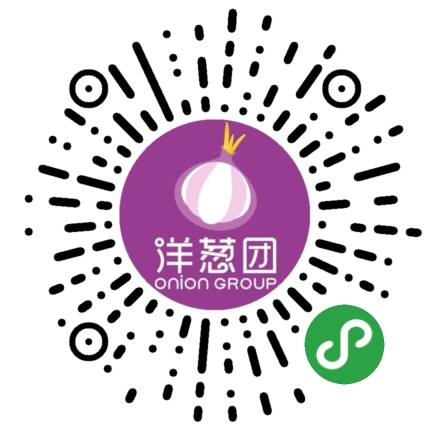

micro-go 

微服务-GO[HTTP]  

[http版本, 与rpc版本[deercoder-chat](https://github.com/dreamlu/deercoder-chat)对应]  

- 目标: 快速开发, 开箱即用

- TODO  
1.CRUD  
2.快速开发  
3.[个人]业务中常用接口  
4.[docker-compose](docker/docker-compose/docker-compose.yaml)  
5.[k8s](docker/k8s/)[多注册多节点有待增加]  
6.稳定地运行在一个业务上 
7.稳定地运行在一个大型业务上 todo  
8.备份、容灾、监控、熔断等等 todo  
9.发布回滚,无缝更新[配合k8s]  
n... todo  

线上项目如下：  

  

- [已实现api在线预览](https://www.eolinker.com/#/share/index?shareCode=7Wl9J7)

- 知识  
 
| router | micro |  
| ------ | ---- |  
| gin | go-micro | 

ps:  
1.模块间调用: http版, 目前就是直接访问调用的方式, docker构建包会变大一些